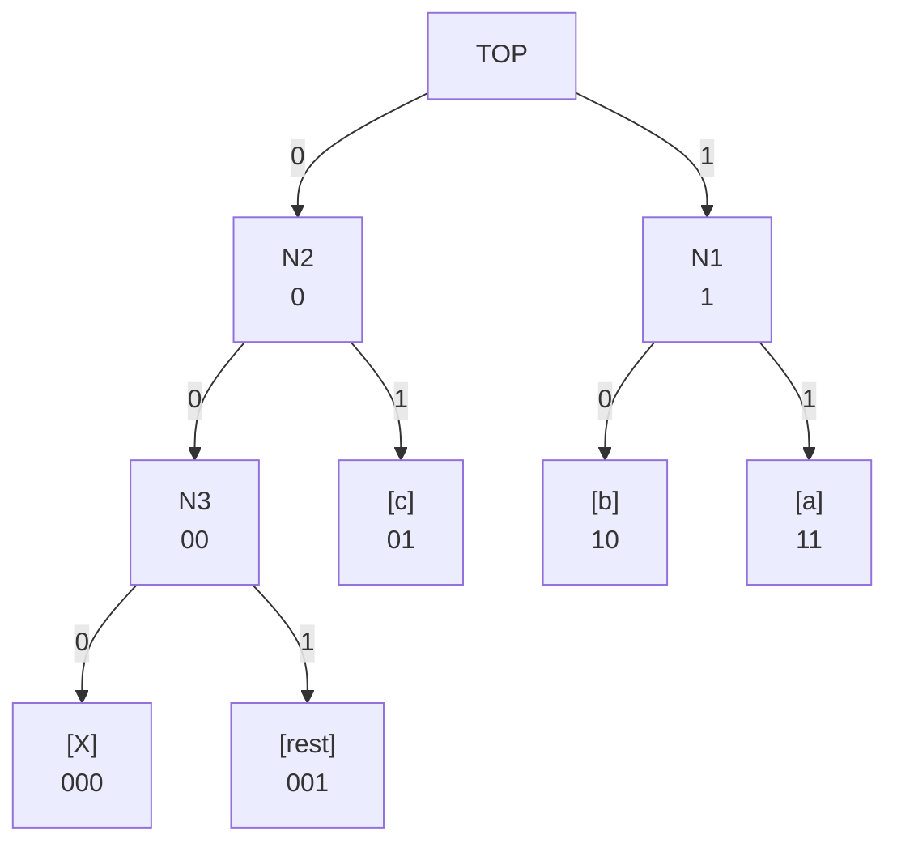

Minimal String Compressor
=========================

- [Overview](#overview)
  - [Goals](#goals)
  - [Non-Goals](#non-goals)
  - [Limitations](#limitations)
- [Usage](#usage)
  - [Preparation/Compressing Data](#preparationcompressing-data)
  - [Decompressing Data](#decompressing-data)
- [Principle](#principle)
  - [Encoding](#encoding)
  - [Decoding](#decoding)
- [References](#references)

## Overview
Compresses string data with a modified Huffman encoding that allows minimal memory 
footprint decoding and configurable compression overhead for the tree.

Encoding is done via Python.  
Decoding functionality implemented in C (and in Python for reference).

### Goals
  - low decoding code size
  - low decoding ram requirement
  - low decoding data overhead

--> so it is suitable for low grade micro controller (e.g. AVR/Arduino)

### Non-Goals
  - maximum compression rates
  - efficient **en**coding code

### Limitations
  - not a current but principal limitation:
    - maximal 64 nodes can be used to encode the tree.  
      If more different symbols are present in input data one node is used 
      as 'rest' node that contains an decompressed symbol.
  - binary data works in principle but is not optimal, since `0xFF` is used as 'rest' symbol that would require that each `0xFF` in the actual data (in binary data this may be more common) is encoded as 'rest'-Symbol + `0xFF`-data)
  - very common symbols cannot be encoded as 1-bit symbol since the 'TOP'-node has no leaf-indicator bits
  - 'rest' node is slightly inefficient for normal strings, as most characters are require less than 8 bits
      - may be different 'rest' nodes 5,6,7,8 bit codes
  - currently handling of data in program memory (harvard architecture CPU) is not well supported and have to be adapted manually

These limitations could be solved by additional decoding data:
  - a byte that told the actual 'rest' token
  - at least two bits that contain the leaf-flags of the top node

## Usage
This chapter describes the usage of this software. For background and working details see chapter [Principle](#Principle).

### Preparation/Compressing Data
The StringCompressor library can to be used to generate decoding data and compressed data.
However `StringCompressorCli.py` can can make this a lot easier by generating a C-header based on an input file the user has to provide. 

The the following code represents a minimum data file:

    {
      'data' : [
        {
          "name" : "c_myDecompressData",
          "data":{
            "c_myData1":"Hello World",
            "c_myData2":"Hello World\n - this is a test text for compression",
          }
        },
      ]
    }

The file `data.py` provide a extensively documented example including means to control the generated output.

From this a header file can be generated by  

    python StringCompressorCli.py dataMin.py > dataMin.h

The generated Header looks as follows:

    static const uint8_t c_myDecompressData[][2] = 
    {{130, 1},
     {132, 131},
     {255, 133},
     {32, 198},
     {111, 199},
     {108, 136},
     {116, 101},
     {114, 115},
     {105, 201},
     {87, 72}};

    static const uint8_t c_myData1[] = 
    {95, 233, 76, 233, 72, 100};

    static const uint8_t c_myData2[] = 
    {11, 253, 41, 157, 41, 12, 128, 86, 11, 119, 13, 13, 121, 175, 12, 59, 190, 251,
     119, 143, 29, 134, 105, 88, 99, 131, 104, 225, 95, 118, 208, 110};

Please note that for that small texts the compression including the decoding data may be inefficient.


### Decompressing Data

The generated header and the `StringDecompressor.h` should be included. It provides two means of decompressing:

1. decompressing using a callback that gets called for each decoded symbol
2. decompressing into a buffer

The drawback of the first one obviously is the overhead of a lot of function calls the one of the second the need of a buffer big enough to hold the decompressed data.

using `decompressToBuffer`:

    CompressionData cd = {c_myDecompressData};
    char buf[200];

    uint16_t oLen = decompressToBuffer(&cd, buf, 200, c_myData1, sizeof(c_myData1));

using `decompressToCB`:

    void putCharToOutput(char o, void* unused){
      putchar(o);
      (void)unused;
    }
    // [...]
    decompressToCB(cd, &putCharToOutput, NULL, c_myData2, sizeof(c_myData2));


## Principle
### Encoding
The compressor uses at most `maxTree` nodes to built up a huffman tree. 
If there are more symbols in the data than `maxTree + 1` then an 'rest' node is created.
Symbols in the 'rest' node are encoded by the bit pattern of this node following by the 8bit of the symbol itself.

The actual tree is encoded with 2 bytes per node. Each byte contains the id of the
following node depending if the bit in the stream is a *0* or *1*. 
The first 2 bits in the id's encode if the next node contains leaf nodes. 
In this case the nodes byte is not the id but the actual encoded symbol.

The following string with `maxTree = 4`
```
abbaaaaabbaacXKJabbcca
```

will result in a graph like this:



Using this tree and the resulting symbol table would result in the following binary encoding of the above string.

All symbols that do not have an own leaf node get the 'rest' symbol followed by the unencoded 8bit of the symbol.


```
 a  b  b  a  a  a  a  a  b  b  a  a  c   X     K            J         a  b  b  c  c  a
11 10 10 11 11 11 11 11 10 10 11 11 01 000 001-01001011 001-01001010 11 10 10 01 01 11
```
Since we require whole bytes and zeros at start or end would result in ambiguities a start bit is added at front and the whole string is right aligned with zero padding left (in this case only the start bit as the length then is a multiple of 8).

```
1-1110101 11111111 11010111 10100000 10100101 10010100 10101110 10010111
```

converting into 8 bytes:

```
245, 255, 215, 160, 165, 148, 174, 151
```


The encoded tree in the final data will look like this (two bytes for each non-leaf node): 

```C
static const uint8_t s_decompData[][2] = 
  {{66, 193}, {98, 97}, {195, 99}, {88, 255}}
```

So even with this small 22 character long example string there is already some saving, even with including the decompression data (8 further bytes) that may be used for multiple strings.


### Decoding

The above mentioned encoded tree data
```C
static const uint8_t s_decompData[][2] = 
  {{66, 193}, {98, 97}, {195, 99}, {88, 255}}
```

is interpreted as depicted in the following table:

|  name   |       TOP       |    N1    |        N2       |     N3     |
| :-----: | :-------------: | :------: | :-------------: | :--------: |
| node id |   0             |  1       |   2             |   3        |
| data 0  |  66 [ 0 1 - 2 ] | 98 ['b'] | 193 [ 1 1 - 3 ] |  88  ['X'] |
| data 1  | 193 [ 1 1 - 1 ] | 97 ['a'] |  99 ['c']       | 255 [rest] |

the data in the rectangular brackets mean either the decoded symbol if the nodes branch is a leaf or in case of a non-leaf node the upper two bits and the id that was encoded within the data byte.
The upper 2 bits indicate weather the following node has leaf childs or not. The leftmost bit if the *0* child is a leaf and the next bit if the *1* child is a leaf.

Note: This implies that the top node can not directly contain leaf nodes, because the flags are encoded within the parent node

Decoding example
```
11110101 11111111 11010111 10100000 10100101 10010100 10101110 10010111
```
- Step 1: 
  - curNode = 0 --> childs: {66, 193}
  - throw away all leading zeros and the first 1-bit
    `1 - 1110101 1...`

- Step 2:
  - read bit (`1`) `1 - [1]110101 1...` 
  - 1-child `193` --> `0b11_000001` 
    - next Node is id 1
    - both child of Node 1 are leafs
- Step 3:
  - read bit (`1`) `1 - 1[1]10101 1...`
  - 1-child `97` 
    - we know this is leaf, so the `97` is the resulting byte (`'a'`)
    - --> next node is id 0 again
- Step 4:
  - read bit (`1`) `1 - 11[1]0101 1...` 
  - 1-child `193` --> `0b11_000001` 
    - next Node is id 1 
    - both child of Node 1 are leafs
- Step 5:
  - read bit (`0`) `1 - 111[0]101 1...`
  - 0-child `98` 
    - we know this is leaf, so the `98` is the resulting byte (`'b'`)
    - --> next node is id 0 again
- Step 6 - 25:
  - repeat steps 2/3 and 4/5 a few times
  - `1-1110[101 11111111 11010111 1]0100000 10100101 10010100 10101110 10010111`
- Step 26:
  - read bit (`0`) `... 1[0]100000 1...`
  - 0-child `66`  --> `0b01_000010` 
    - next Node is id 2 
    - 0-child of node 2 is not a leaf
    - 1-child of node 2 is a leaf
- Step 27:
  - read bit (`1`) `... 10[1]00000 1...`
  - 1-child `99` 
    - we know this is leaf, so the `99` is the resulting byte (`'c'`)
    - --> next node is id 0 again
- Step 28:
  - read bit (`0`) `... 101[0]0000 1...`
  - 0-child `66`  --> `0b01_000010` 
    - next Node is id 2 
    - 0-child of node 2 is not a leaf
    - 1-child of node 2 is a leaf
- Step 29:
  - read bit (`0`) `... 1010[0]000 1...`
  - 0-child `193` --> `0b11_000011` 
    - next Node is id 3
    - 0-child of node 3 is a leaf
    - 1-child of node 3 is a leaf
- Step 30:
  - read bit (`0`) `... 10100[0]00 1...`
  - 0-child `88` 
    - we know this is leaf, so the `88` is the resulting byte (`'X'`)
    - --> next node is id 0 again
- Step 31:
  - read bit (`0`) `...000[0]0 10100101 10010...`
  - 0-child `66`  --> `0b01_000010` 
    - next Node is id 2 
    - 0-child of node 2 is not a leaf
    - 1-child of node 2 is a leaf
- Step 32:
  - read bit (`0`) `...0000[0] 10100101 10010...`
  - 0-child `193` --> `0b11_000011` 
    - next Node is id 3
    - 0-child of node 3 is a leaf
    - 1-child of node 3 is a leaf
- Step 33:
  - read bit (`1`) `...00000 [1]0100101 10010...`
  - 1-child `255` 
    - we know this is leaf, so the `255` is the resulting symbol
    - `255` encodes a special case - the 'rest' node
    - --> read 8 bits to get the actual data `...00000 1[0100101 1]0010...` --> `75` (`'K'`)
    - --> next node is id 0 again
- Steps 34-36:
  - repeat steps 31-33 (decode 'rest' symbols, but different data byte)
  - `...0101 1[001-0100 1010]1110 10010111` --> `74` (`'J'`)
- Steps 37-xxx
  - analog decoding of the rest of the stream
  - `...10010100 1010[11][10] [10][01][01][11]` --> `"abbcca"`

## References
 - basic theory
   - Huffman encoding https://en.wikipedia.org/wiki/Huffman_coding
   - Shanon Fano encoding https://en.wikipedia.org/wiki/Shannon%E2%80%93Fano_coding
 - other projects
   - Shox96 (deprecated) https://github.com/siara-cc/Shox96
   - Unishox2 https://github.com/siara-cc/Unishox2
   - Shoco https://ed-von-schleck.github.io/shoco/
   - Smaz https://github.com/antirez/smaz